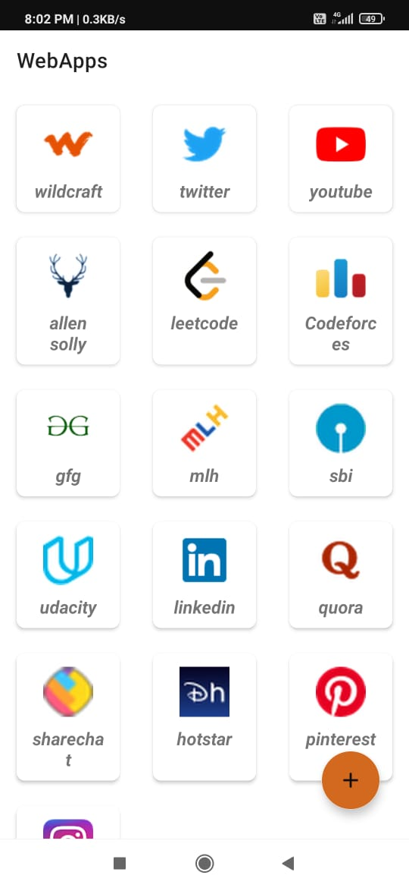

# Hackathon name- HackNITR

# Team members-
1. Aditi jha- @aditi944
2. Satendra pal
3. Faiz imam
4. Abhiram borige- @Abhiramborige

# Problem statement-  
Quite often, we were not able to play high storage games due to the overload of necessary apps .
Also, nowadays we have a lot of websites to use but using browser is a two step process and for easy login we have to give them our password information .

# Our idea- 
So we decided to utilize the web versions of those apps so that our work can easily be done . So we decided to make an app that stores your passwords along with the link to the webApps .

# Overview

   
  

# Tools-
1. Android studio
2. Github

# Languages-
1. Kotlin
2. XML
3. Components- MVVM pattern , ROOM database , Navigation components , Safe args

# Our inspiration behind this project- 
The power of web is growing drastically.
Soon, the web becomes counterpart to app world in every aspect.
Increase and support of PWAs.
Ease of development, more opportunities.
Platform independent.

# Future scope
1. Web authomation
2. Reomemdation system
3. Auto clustering

# Challenges we ran into
1. Choosing a stack
2. Updation
3. Automation
4. Lack of experience
