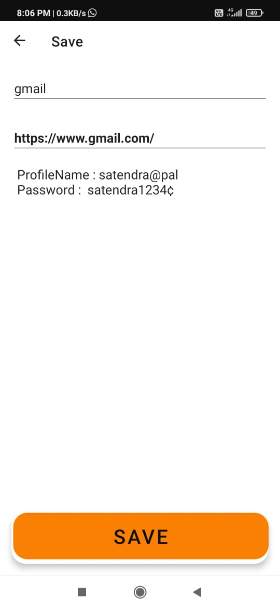
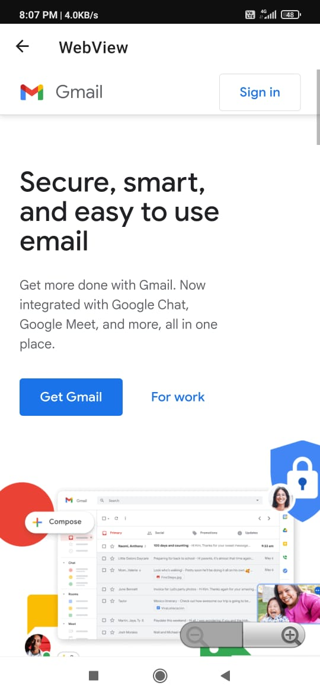
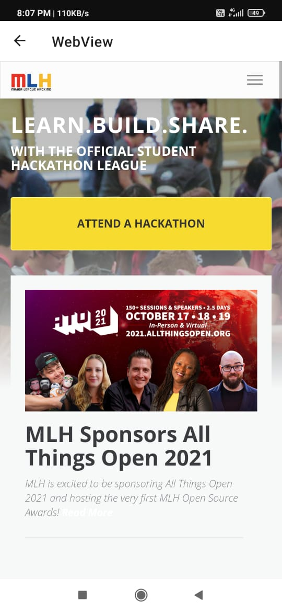

# Hackathon name- HackNITR

# Made By->
2. Satendra pal- @Satendra9984

# Problem statement-  
Quite often, we were not able to play high storage games due to the overload of necessary apps .
Also, nowadays we have a lot of websites to use but using browser is a two step process and for easy login we have to give them our password information .

# Our idea- 
There are over 1.7 billion websites and it is hard to remember every website out there, The main problem arises when we have to remember the password for all these different websites, So we came up with the solution to build a platform where we can store all the necessary websites so we can open them whenever we want, we also added the feature where we can store our username and password to make our experience much better. 

# Application Interface-

   
  

  
  
  

# Tools-
1. Android studio
2. Github
3. Glide API

# Languages-
1. Kotlin
2. XML
3. Components- MVVM pattern , ROOM database , Navigation components , Safe args, Deep Linking

# Our inspiration behind this project- 
The power of web is growing drastically.
Soon, the web becomes counterpart to app world in every aspect.
Increase and support of PWAs.
Ease of development, more opportunities.
Platform independent.

# Future scope
1. Cloud Computing
2. Web automation 
3. Recommendation system
4. Auto clustering

# Future Upgrades
1. Security using webApps support
2. Custom App Icons
3. Folders to group similar websites together

# Challenges we ran into
1. Choosing a stack
2. Updation
3. Automation
4. Lack of experience
